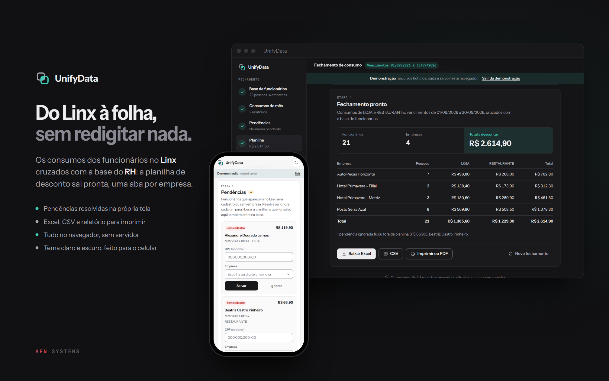
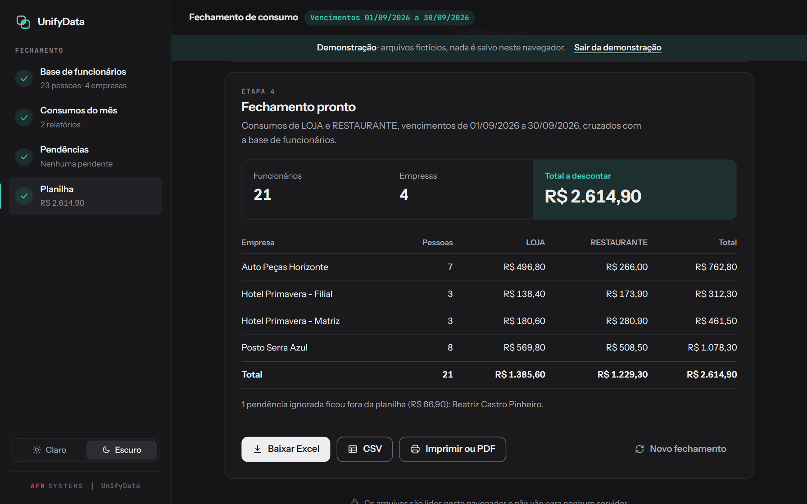
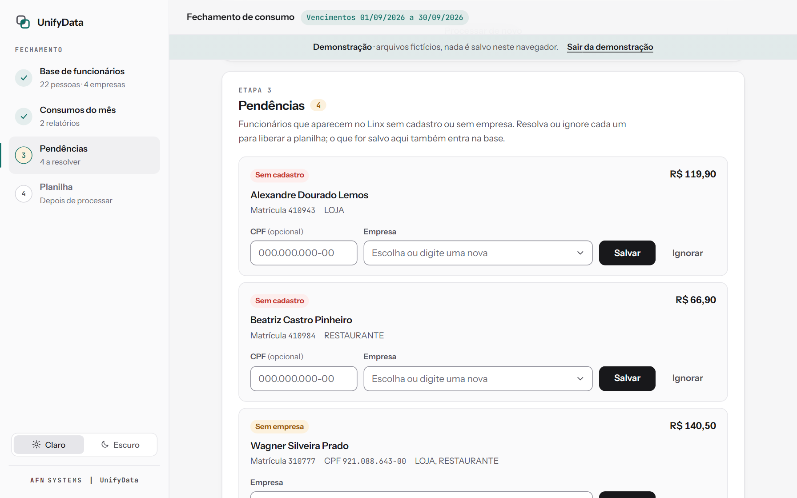
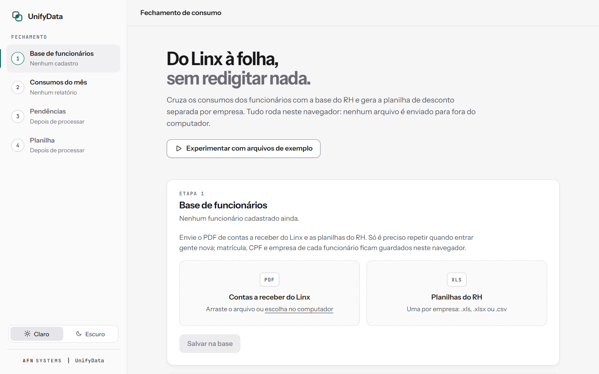
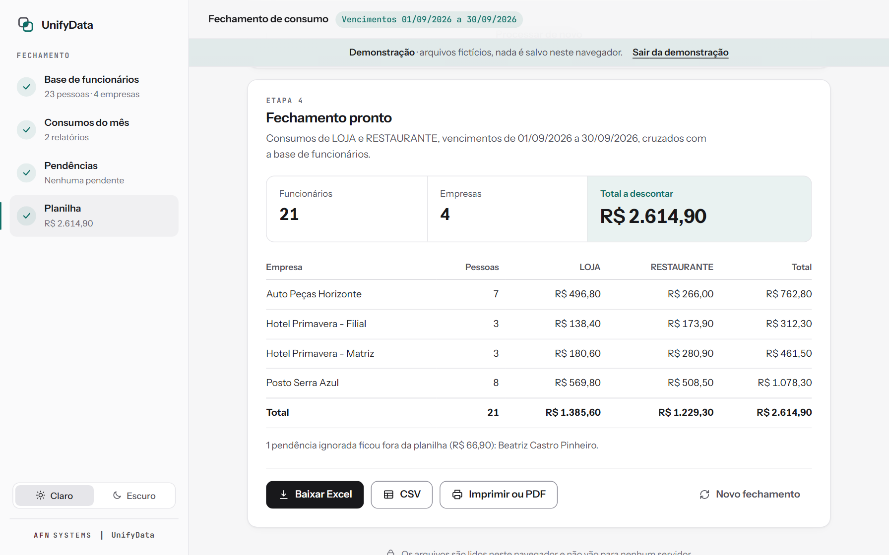
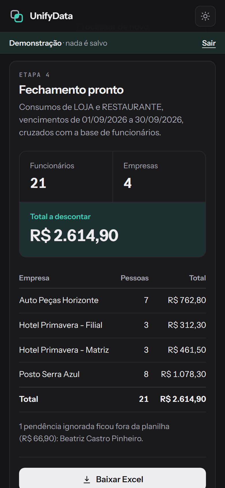
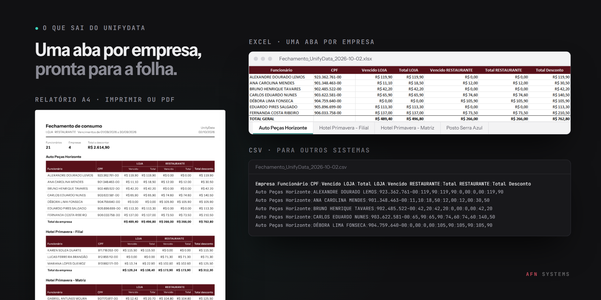

# UnifyData Web



**O UnifyData faz o fechamento mensal do consumo dos funcionários** de
um grupo de empresas. Eles compram fiado nas lojas do próprio grupo
(posto, restaurante, hotel), e o Linx AutoSystem, o sistema de gestão das
lojas, registra cada compra na matrícula do funcionário. No fim do mês,
alguém precisa transformar esses relatórios do Linx em uma planilha de
desconto em folha para cada empresa. O UnifyData cruza os relatórios do
mês com a base de funcionários (matrícula, CPF e empresa) e devolve a
planilha, uma aba por empresa.

Roda inteiro no navegador, em JavaScript puro: sem framework, sem etapa de
build e sem servidor. Os arquivos são lidos no computador e não saem dele.

**[Abrir o UnifyData](https://alyssom-fernandes.github.io/UnifyData-Web/)** · **[Ver a demonstração](https://alyssom-fernandes.github.io/UnifyData-Web/?demo=1)**, com
arquivos fictícios: nada é salvo.

[](https://github.com/alyssom-fernandes/UnifyData-Web/actions/workflows/testes.yml)


Este README também está em [inglês](README.md).

## Em 30 segundos

1. Abra a [demonstração](https://alyssom-fernandes.github.io/UnifyData-Web/?demo=1).
   Ela carrega os arquivos de exemplo: o PDF de Contas a Receber do Linx,
   três planilhas do RH e os relatórios de consumo de duas lojas, LOJA e
   RESTAURANTE.
2. Clique em **Processar fechamento**. Aparecem quatro pendências: duas
   pessoas que estão no Linx, mas não na base, e duas sem empresa. Escolha
   a empresa de cada uma (o CPF é opcional) ou ignore.
3. O fechamento fica pronto: totais por empresa e por loja, e os botões
   **Baixar Excel**, **CSV** e **Imprimir ou PDF**.

## Telas

Tiradas do modo de demonstração.

| Fechamento pronto, tema escuro | Pendências, tema claro |
|---|---|
|  |  |
| **Início, tema claro** | **Fechamento pronto, tema claro** |
|  |  |

| No celular, tema claro | No celular, tema escuro |
|---|---|
|  |  |

## O que sai



- **Excel**: uma aba por empresa, pronta para a folha. Cabeçalho fixo,
  formato de moeda, CPF formatado e linha de total com fórmulas `SOMA`
  (o resultado já vem gravado, e as fórmulas recalculam se alguém editar
  uma célula). O nome das abas é sempre aceito pelo Excel: caracteres
  proibidos, o limite de 31 caracteres, o nome reservado *History* e nomes
  repetidos são tratados, e nome longo é cortado em palavra inteira. Cada
  aba já sai configurada para imprimir em A4, na largura da página.
- **CSV**: separado por `;` e com vírgula decimal, como o Excel em
  português abre, com a coluna da empresa.
- **Relatório** para imprimir ou salvar em PDF: A4, em paisagem quando há
  três lojas ou mais, cada empresa inteira na página quando cabe, e páginas
  numeradas. As pendências ignoradas aparecem no rodapé, para nada sair do
  fechamento em silêncio.

## O que faz

### Base de funcionários

- Montada uma vez e depois atualizada só quando entra gente nova: o PDF de
  *Contas a Receber* do Linx traz matrícula, nome e CPF; as planilhas do
  RH (.xls, .xlsx ou .csv) trazem a empresa.
- O nome do arquivo vira o nome da empresa (`Empregados Posto Central.xls`
  vira *Posto Central*); uma pasta de trabalho com várias abas vira
  *Empresa - Aba*, a menos que a aba tenha o nome padrão do Excel (Plan1,
  Planilha1...).
- Fica salva no navegador. Enviar de novo só acrescenta e corrige; nada
  do que já está lá se perde.

### Fechamento do mês

- Os relatórios *Pendências por responsável* do Linx, um CSV por loja. O
  nome do arquivo vira o nome da coluna.
- Dois valores por pessoa e loja: *vencido* e *total*. O período de
  vencimentos é lido do relatório e aparece na tela e no relatório
  impresso.
- O cruzamento é **pela matrícula**: exato, não depende de como o nome
  foi escrito.

### Pendências

- Quem está no Linx sem cadastro, ou sem empresa, aparece para ser
  resolvido na hora: CPF com máscara, empresa com sugestões (ou uma
  nova). O que é salvo ali também entra na base.
- Ou é ignorado, e o resultado e o relatório dizem quem ficou de fora e
  quanto.

### Celular, temas e detalhes

- Tema claro e escuro, seguindo o sistema na primeira visita, sem piscar
  ao carregar.
- Lateral com as quatro etapas e a situação de cada uma. No celular
  (testado a partir de 375 px de largura), entra uma barra no topo e os
  cartões ocupam a largura inteira.
- Leitura tolerante: arquivos em Windows-1252 ou UTF-8, CSV do RH com
  `;` ou `,`, CPF guardado como número no Excel (os zeros à esquerda
  voltam), linhas de total em layouts diferentes do Linx.
- Um arquivo enviado de novo com o mesmo nome substitui o anterior.

## Privacidade e segurança

- **Sem servidor.** Planilhas, PDFs e relatórios são lidos pelo próprio
  navegador (SheetJS e PDF.js) e não são enviados para lugar nenhum.
- **A base** (matrícula, nome, CPF e empresa) fica no `localStorage`
  deste navegador, só neste computador. Ela não é criptografada: quem tem
  acesso a este perfil do navegador consegue lê-la.
- **A demonstração** usa uma base em memória: nunca lê nem altera a base
  de verdade.
- **Content Security Policy** sem `'unsafe-inline'`. SheetJS, ExcelJS e
  PDF.js têm versão fixa e são carregados com Subresource Integrity (SRI),
  só quando necessários (o worker do PDF.js tem versão fixa, mas sem hash,
  porque um worker não aceita SRI); o PDF.js roda com `eval` desligado.
- **Texto vindo dos arquivos nunca é confiável**: nomes e nomes de arquivo são
  escapados antes de virar HTML, e células do CSV que começam com `=`,
  `+`, `-` ou `@` ganham um apóstrofo na frente, para a planilha não
  executar uma fórmula escondida num nome.

## Como é feito

| Parte | Tecnologia |
|---|---|
| Interface | HTML, CSS e JavaScript, sem framework e sem build |
| Leitura | SheetJS 0.20 para as planilhas do RH, PDF.js 3.11 para o PDF do Linx |
| Escrita | ExcelJS 4.4 para o .xlsx; o CSV e o relatório são feitos pelo app |
| Dados | `localStorage` para a base e o tema |
| Fontes | Instrument Sans na interface; JetBrains Mono em números, rótulos e na assinatura (Google Fonts) |
| Testes | `node --test`, sem dependências, a cada push (GitHub Actions) |

Algumas decisões por trás:

- **As regras ficam separadas da tela.** Tudo o que decide um número está
  em `js/nucleo.js`, em funções puras: leitura dos relatórios do Linx e
  dos arquivos do RH, atualização da base, cruzamento, agrupamento por
  empresa, nomes de aba e CSV. Os testes rodam essas funções no Node, com
  os mesmos arquivos de exemplo da demonstração.
- **Scripts clássicos, não módulos**, para o `index.html` funcionar também
  com dois cliques, direto do disco.
- **Bibliotecas sob demanda.** Abrir a página não baixa nada pesado; o
  primeiro PDF ou planilha traz só a biblioteca que precisa.
- **Nada some em silêncio.** As pendências ignoradas aparecem, com o
  valor, na tela e no relatório, e um arquivo do tipo errado é recusado
  com aviso em vez de ser pulado.

## Limitações conhecidas

- Depende do layout dos dois relatórios do Linx: o PDF de Contas a
  Receber (linhas como `Pessoa: <matrícula> - <nome> - <CPF>`) e o CSV de
  Pendências por responsável.
- A base fica em um navegador. Limpar os dados do site apaga a base, e
  outro computador começa vazio.
- As bibliotecas e fontes vêm de CDNs, então o primeiro PDF ou planilha da
  sessão precisa de internet.
- A demonstração busca os arquivos com `fetch`, então precisa da página
  servida por HTTP (GitHub Pages ou um servidor local), não aberta do
  disco.
- Testado no Chrome e no Edge, no computador e na largura de celular.

## Rodando a sua cópia

Abra o `index.html` no navegador. Para o uso real, é só isso; a
demonstração precisa da pasta servida, por exemplo com:

```bash
python -m http.server 8000
```

e depois `http://localhost:8000/?demo=1`. O GitHub Pages serve a pasta
como está.

Para rodar os testes (Node 22 ou mais novo, nada para instalar):

```bash
node --test
```

## Estrutura do projeto

```
index.html            a página: lateral, as quatro etapas e o relatório
404.html              página para endereços que não existem
favicon.svg           a marca do UnifyData
css/style.css         temas claro e escuro, celular e impressão
js/
  boot.js             tema antes da página aparecer, e o registro de erros
  nucleo.js           regras puras: leitura, base, cruzamento, abas, CSV
  app.js              tela, envios, pendências e exportações
tests/                testes das regras, com os arquivos de exemplo
exemplos/             arquivos fictícios nos formatos do Linx e do RH
.github/workflows/    roda os testes a cada push
docs/telas/           imagens deste README e da prévia de link (og.png)
```

## A versão em Python

O [UnifyData Python](https://github.com/alyssom-fernandes/UnifyData-Python)
faz o mesmo fechamento para quando o Linx e o RH não têm código em comum:
liga as pessoas **pelo nome**, com busca aproximada, e só pergunta a uma
pessoa os casos em dúvida. É feito com Streamlit e roda no próprio
computador.

## Licença

[MIT](LICENSE). Feito por [Alyssom Fernandes](https://github.com/alyssom-fernandes), AFN Systems.
